# KanFlow 사용자 메뉴얼

> **버전**: v2.0
> **최종 수정일**: 2026-02-25
> **대상**: KanFlow 일반 사용자

---

## 목차

1. [시작하기](#1-시작하기)
   - [1.1 로그인 / 회원가입](#11-로그인--회원가입)
   - [1.2 워크스페이스 선택](#12-워크스페이스-선택)
   - [1.3 화면 구성 (4패널 레이아웃)](#13-화면-구성-4패널-레이아웃)
   - [1.4 화면 설정 (테마 / 언어)](#14-화면-설정-테마--언어)
2. [워크스페이스](#2-워크스페이스)
   - [2.1 워크스페이스 목록](#21-워크스페이스-목록)
   - [2.2 보드 목록 및 관리](#22-보드-목록-및-관리)
   - [2.3 워크스페이스 설정](#23-워크스페이스-설정)
3. [보드 사용법](#3-보드-사용법)
   - [3.1 칸반 보드 (기본 뷰)](#31-칸반-보드-기본-뷰)
   - [3.2 카드 생성](#32-카드-생성)
   - [3.3 카드 드래그 앤 드롭](#33-카드-드래그-앤-드롭)
   - [3.4 컬럼 관리](#34-컬럼-관리)
4. [카드 상세](#4-카드-상세)
   - [4.1 카드 상세 패널 열기](#41-카드-상세-패널-열기)
   - [4.2 라벨 관리](#42-라벨-관리)
   - [4.3 설명 작성](#43-설명-작성)
   - [4.4 체크리스트](#44-체크리스트)
   - [4.5 댓글](#45-댓글)
   - [4.6 첨부파일](#46-첨부파일)
   - [4.7 우선순위 / 담당자 / 날짜](#47-우선순위--담당자--날짜)
   - [4.8 작업시간](#48-작업시간)
   - [4.9 태그](#49-태그)
   - [4.10 카드 링크](#410-카드-링크)
   - [4.11 커스텀 필드](#411-커스텀-필드)
   - [4.12 카드 복사 / 삭제](#412-카드-복사--삭제)
5. [다양한 뷰](#5-다양한-뷰)
   - [5.1 리스트 뷰](#51-리스트-뷰)
   - [5.2 캘린더 뷰](#52-캘린더-뷰)
   - [5.3 타임라인 뷰](#53-타임라인-뷰)
   - [5.4 스윔레인 뷰](#54-스윔레인-뷰)
6. [검색 및 필터](#6-검색-및-필터)
   - [6.1 카드 검색](#61-카드-검색)
   - [6.2 고급 필터](#62-고급-필터)
   - [6.3 저장된 필터](#63-저장된-필터)
7. [알림](#7-알림)
   - [7.1 알림 확인](#71-알림-확인)
   - [7.2 알림 관리](#72-알림-관리)
8. [대시보드](#8-대시보드)
   - [8.1 나의 할당 카드](#81-나의-할당-카드)
   - [8.2 마감 임박 카드](#82-마감-임박-카드)
   - [8.3 최근 활동](#83-최근-활동)
   - [8.4 보드 요약](#84-보드-요약)
9. [활동 로그](#9-활동-로그)
10. [아카이브](#10-아카이브)
11. [키보드 단축키](#11-키보드-단축키)
12. [자동화 규칙](#12-자동화-규칙)
    - [12.1 자동화 규칙 목록](#121-자동화-규칙-목록)
    - [12.2 자동화 규칙 생성](#122-자동화-규칙-생성)
13. [리포트](#13-리포트)
    - [13.1 보드 통계 요약](#131-보드-통계-요약)
    - [13.2 분석 차트](#132-분석-차트)

---

## 1. 시작하기

### 1.1 로그인 / 회원가입

KanFlow에 접속하면 가장 먼저 로그인 화면이 표시됩니다. 기존 계정으로 로그인하거나, 신규 사용자는 회원가입을 진행합니다.

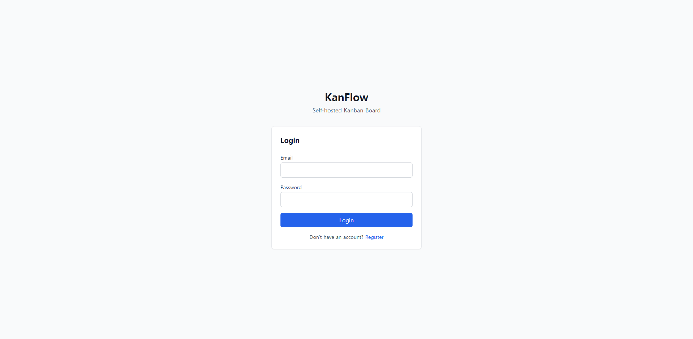

**로그인 방법**

1. 단계 1: 브라우저에서 KanFlow 주소로 접속합니다 (예: `http://your-server`).
2. 단계 2: **Email** 필드에 등록된 이메일 주소를 입력합니다.
3. 단계 3: **Password** 필드에 비밀번호를 입력합니다.
4. 단계 4: **Login** 버튼을 클릭합니다.

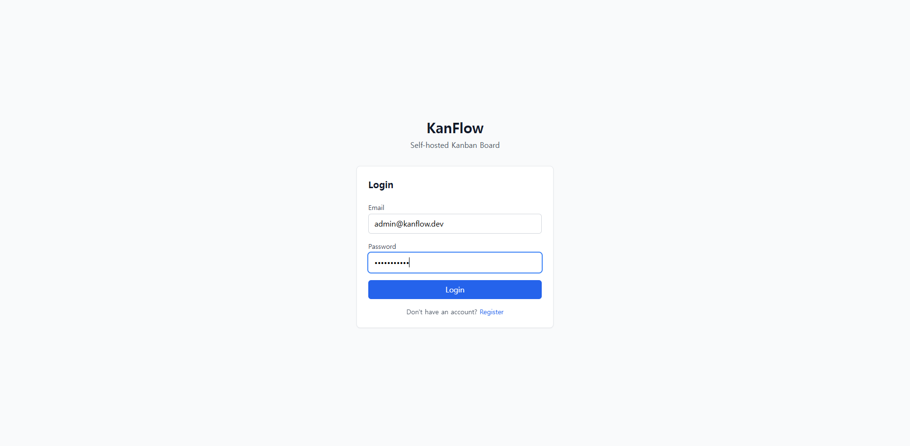

**회원가입 방법**

1. 단계 1: 로그인 화면 하단의 **Register** 링크를 클릭합니다.
2. 단계 2: 이름, 이메일, 비밀번호를 입력합니다.
3. 단계 3: 회원가입 완료 후 자동으로 로그인됩니다.

> **팁:** KanFlow는 자체 호스팅 서비스이므로 관리자가 미리 계정을 생성해 두거나 회원가입을 허용한 경우에만 신규 등록이 가능합니다. 접속이 되지 않을 경우 시스템 관리자에게 문의하세요.

---

### 1.2 워크스페이스 선택

로그인에 성공하면 **My Workspaces** 페이지로 이동합니다. 여기서 작업할 워크스페이스를 선택합니다.

1. 단계 1: 목록에서 원하는 워크스페이스 카드를 클릭합니다.
2. 단계 2: 해당 워크스페이스의 보드 목록 페이지로 이동합니다.

> **팁:** 좌측 NavBar 최상단의 홈 아이콘을 클릭하면 언제든지 워크스페이스 목록으로 돌아올 수 있습니다.

---

### 1.3 화면 구성 (4패널 레이아웃)

KanFlow는 Slack 스타일의 4패널 레이아웃을 사용합니다.

| 패널 | 너비 | 역할 |
|------|------|------|
| NavBar (좌측 수직 바) | 56px | 홈, 보드 검색, 활동/알림, 대시보드, 사용자 메뉴 |
| BoardSidebar | 240px | 즐겨찾기 보드, 최근 보드, 전체 보드 목록 |
| 메인 영역 | 나머지 | 보드, 캘린더, 타임라인 등 현재 뷰 |
| DetailPanel (우측) | 420px | 카드 상세, 활동 로그, 아카이브 등 슬라이드 패널 |

BoardSidebar와 DetailPanel은 패널 경계를 드래그하여 너비를 조절할 수 있습니다.

---

### 1.4 화면 설정 (테마 / 언어)

### 테마 변경
1. NavBar 하단의 사용자 아바타를 클릭합니다.
2. 드롭다운 메뉴에서 테마 토글 (Sun/Moon/Computer 아이콘)을 클릭합니다.

| 모드 | 설명 |
|------|------|
| Light | 밝은 화면 |
| Dark | 어두운 화면 |
| System | OS 설정 자동 따름 |

선택한 테마는 브라우저에 저장되어 새로고침 후에도 유지됩니다.

### 언어 변경
1. NavBar 하단의 사용자 아바타를 클릭합니다.
2. 드롭다운 메뉴에서 언어 전환 버튼을 클릭합니다.
3. **한국어** 또는 **English** 를 선택합니다.

선택한 언어는 브라우저에 저장되어 새로고침 후에도 유지됩니다.

---

## 2. 워크스페이스

### 2.1 워크스페이스 목록

워크스페이스는 프로젝트 또는 팀 단위로 보드를 묶는 최상위 컨테이너입니다. 내가 속한 모든 워크스페이스가 이 페이지에 표시됩니다.

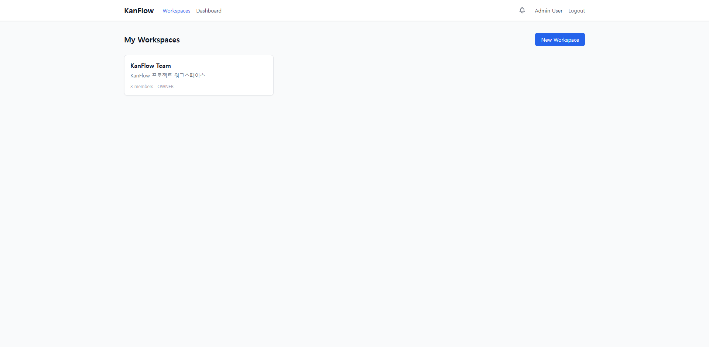

**새 워크스페이스 만들기**

1. 단계 1: 화면 우측 상단의 **New Workspace** 버튼을 클릭합니다.
2. 단계 2: 워크스페이스 이름과 설명을 입력합니다.
3. 단계 3: **Create** 버튼을 클릭하여 생성합니다.

각 워크스페이스 카드에는 다음 정보가 표시됩니다.

| 항목 | 설명 |
|------|------|
| 이름 | 워크스페이스 이름 |
| 설명 | 간단한 설명 텍스트 |
| 멤버 수 | 해당 워크스페이스에 속한 인원 수 |
| 역할 | 현재 사용자의 역할 (OWNER / MEMBER 등) |

> **팁:** 워크스페이스 카드를 클릭하면 해당 워크스페이스의 보드 목록으로 바로 이동합니다.

---

### 2.2 보드 목록 및 관리

워크스페이스를 선택하면 해당 워크스페이스에 속한 보드 목록이 표시됩니다.

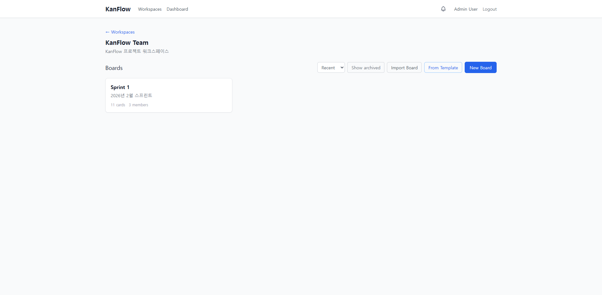

**새 보드 만들기**

1. 단계 1: 화면 우측 상단의 **New Board** 버튼을 클릭합니다.
2. 단계 2: 보드 이름과 설명을 입력합니다.
3. 단계 3: **Create** 버튼을 클릭합니다.

**템플릿으로 보드 만들기**

1. 단계 1: **From Template** 버튼을 클릭합니다.
2. 단계 2: 미리 저장된 보드 템플릿 목록에서 원하는 항목을 선택합니다.
3. 단계 3: 보드 이름을 입력하고 **Create** 버튼을 클릭합니다.

**보드 가져오기**

1. 단계 1: **Import Board** 버튼을 클릭합니다.
2. 단계 2: Trello JSON 또는 CSV 파일을 업로드합니다.
3. 단계 3: 가져오기 설정을 확인하고 완료합니다.

**보드 목록 정렬**

- 목록 상단의 **Recent** 드롭다운을 클릭하여 정렬 기준을 변경할 수 있습니다.
- **Show archived** 버튼을 클릭하면 아카이브된 보드도 함께 표시됩니다.

> **팁:** 보드 카드에는 카드 수, 멤버 수가 함께 표시되어 보드 규모를 한눈에 파악할 수 있습니다.

---

### 2.3 워크스페이스 설정

워크스페이스의 이름·설명 수정, 멤버 초대·역할 변경·제거, 워크스페이스 삭제를 모두 설정 페이지에서 관리합니다.

**설정 페이지 접근**

워크스페이스 상세 페이지 헤더 우측의 **Settings** (⚙) 버튼을 클릭합니다.

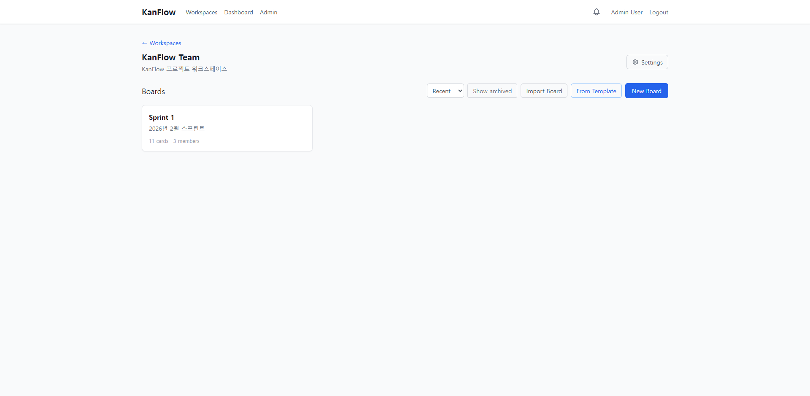

설정 페이지는 **일반(General)** 탭과 **멤버(Members)** 탭으로 구성됩니다.

---

#### 2.3.1 일반 탭

워크스페이스의 기본 정보(이름·설명)를 수정하고, 필요 시 워크스페이스를 삭제할 수 있습니다.

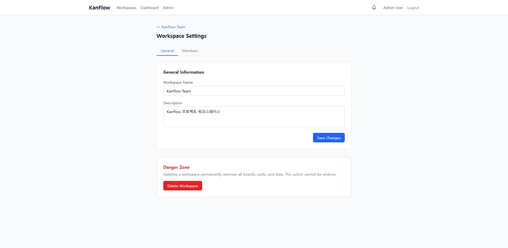

**이름·설명 수정** (OWNER / ADMIN)

1. 단계 1: **Workspace Name** 입력란에서 이름을 수정합니다.
2. 단계 2: **Description** 입력란에서 설명을 수정합니다.
3. 단계 3: **Save Changes** 버튼을 클릭합니다.
4. 저장이 완료되면 상단 헤더에 변경된 이름이 즉시 반영됩니다.

> **참고:** MEMBER / VIEWER 역할의 사용자는 이름과 설명 필드가 읽기 전용으로 표시되며 수정할 수 없습니다.

**워크스페이스 삭제** (OWNER 전용)

1. 단계 1: 페이지 하단 **Danger Zone** 섹션의 **Delete Workspace** 버튼을 클릭합니다.
2. 단계 2: 확인 대화상자에서 **확인**을 클릭합니다.
3. 워크스페이스와 소속된 모든 보드·카드가 영구 삭제되고 홈 화면으로 이동합니다.

> **주의:** 삭제된 워크스페이스는 복구할 수 없습니다. 삭제 전 중요한 데이터를 반드시 백업하세요.

---

#### 2.3.2 멤버 탭

현재 멤버 목록 조회, 역할 변경, 멤버 제거, 신규 멤버 초대를 관리합니다.

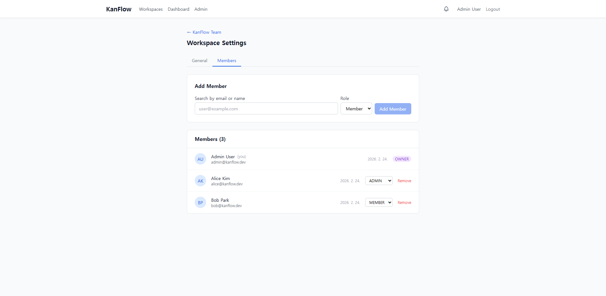

**멤버 목록**

| 항목 | 설명 |
|------|------|
| 아바타 | 이름 첫 두 글자를 이니셜로 표시 |
| 이름 / 이메일 | 멤버의 표시 이름과 이메일 주소 |
| 역할 뱃지 | OWNER · ADMIN · MEMBER · VIEWER |
| 가입일 | 워크스페이스 참여 날짜 |
| 역할 변경 | OWNER만 사용 가능, OWNER 행은 변경 불가 |
| Remove 버튼 | OWNER · ADMIN 사용 가능, OWNER 행은 제거 불가 |

**역할 변경** (OWNER 전용)

1. 변경할 멤버 행의 역할 드롭다운을 클릭합니다.
2. 원하는 역할(ADMIN / MEMBER / VIEWER)을 선택합니다.
3. 즉시 저장되며 뱃지가 새 역할로 갱신됩니다.

**멤버 제거** (OWNER / ADMIN)

1. 제거할 멤버 행의 **Remove** 버튼을 클릭합니다.
2. 해당 멤버가 멤버 목록에서 즉시 사라집니다.

**멤버 초대** (OWNER / ADMIN)

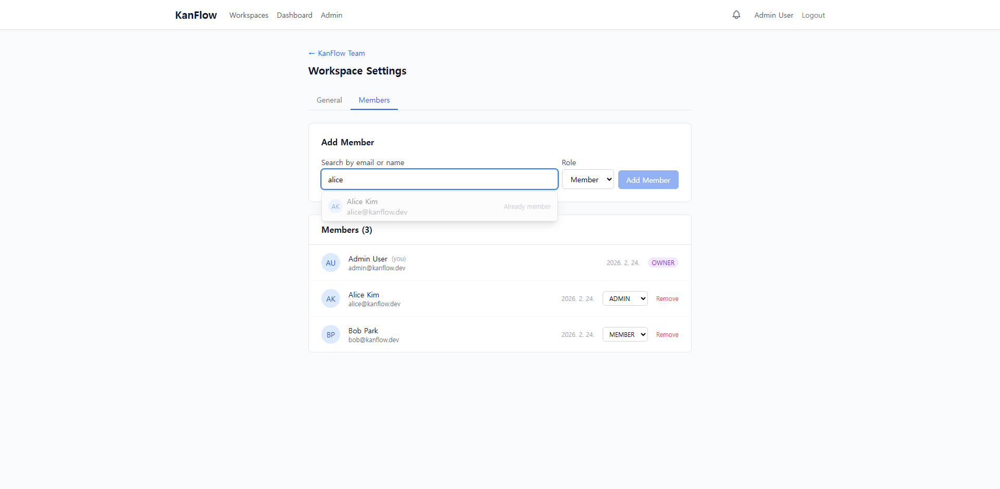

1. 단계 1: **Add Member** 섹션의 이메일 입력란에 초대할 사용자의 이름 또는 이메일을 입력합니다.
2. 단계 2: 0.3초 후 자동으로 검색 결과 드롭다운이 표시됩니다.
   - 이미 멤버인 사용자는 **Already member** 표시와 함께 선택할 수 없습니다.
   - 검색 결과가 없으면 **No users found** 메시지가 표시됩니다.
3. 단계 3: 드롭다운에서 추가할 사용자를 클릭하여 선택합니다.
4. 단계 4: 역할 드롭다운에서 부여할 역할을 선택합니다 (기본값: MEMBER).
5. 단계 5: **Add** 버튼을 클릭하면 멤버 목록에 즉시 추가됩니다.

**역할별 권한 요약**

| 기능 | OWNER | ADMIN | MEMBER | VIEWER |
|------|:-----:|:-----:|:------:|:------:|
| 이름·설명 수정 | ✓ | ✓ | - | - |
| 워크스페이스 삭제 | ✓ | - | - | - |
| 멤버 목록 조회 | ✓ | ✓ | ✓ | ✓ |
| 멤버 초대 | ✓ | ✓ | - | - |
| 역할 변경 | ✓ | - | - | - |
| 멤버 제거 | ✓ | ✓ | - | - |

---

## 3. 보드 사용법

### 3.1 칸반 보드 (기본 뷰)

보드를 클릭하면 칸반 보드 뷰가 열립니다. 카드들이 작업 상태별 컬럼으로 구분되어 표시됩니다.

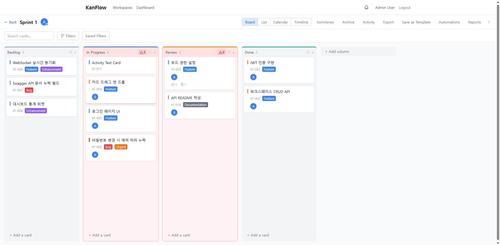

**화면 구성 요소**

| 영역 | 설명 |
|------|------|
| **보드 뷰 탭** | Board / List / Calendar / Timeline / Swimlanes / Archive / Activity / Export / Automations / Reports 전환 (보드 상단) |
| 검색창 | 보드 상단 - 카드 제목으로 즉시 검색 |
| Filters 버튼 | 우선순위, 담당자, 라벨, 마감일 기준으로 필터링 |
| Saved Filters | 저장된 필터 불러오기 |
| **BoardSidebar** | 좌측 240px 패널 - 즐겨찾기 보드, 최근 보드, 전체 보드 목록 |
| 컬럼 헤더 | 컬럼 이름, 카드 수, WIP 초과 경고(삼각형 아이콘), 설정/접기 버튼 |
| 카드 | 제목, 카드 번호(KF-xxx), 라벨, 담당자 아바타, 댓글/첨부 수 표시 |
| + Add column | 새 컬럼 추가 |
| + Add a card | 해당 컬럼에 새 카드 추가 |

**카드에 표시되는 정보**

- 왼쪽 색상 바: 우선순위 색상 (빨강=Critical, 주황=High, 파랑=Medium, 회색=Low)
- 카드 번호: `KF-001` 형식의 자동 증가 ID
- 라벨 배지: 색상 배경의 라벨 텍스트
- 담당자 아바타: 이름 이니셜 원형 아이콘
- 하단 아이콘: 댓글 수(말풍선), 첨부파일 수(클립)

**WIP 제한 표시**

컬럼 헤더에 삼각형 경고 아이콘(예: `△3`)이 표시되면 해당 컬럼에 WIP(Work In Progress) 제한이 설정되어 있으며 현재 카드 수가 제한을 초과했거나 근접했음을 의미합니다.

> **팁:** 보드 상단의 뷰 전환 탭을 통해 List, Calendar, Timeline, Swimlanes 등 다양한 뷰로 즉시 전환할 수 있습니다. 현재 활성화된 뷰 탭은 파란색으로 강조 표시됩니다.

---

### 3.2 카드 생성

컬럼에 새 카드를 추가하는 방법은 두 가지입니다.

**방법 1 - 컬럼 하단 버튼 사용**

1. 단계 1: 카드를 추가할 컬럼 하단의 **+ Add a card** 버튼을 클릭합니다.
2. 단계 2: 카드 제목을 입력합니다.
3. 단계 3: **Enter** 키 또는 저장 버튼을 눌러 카드를 생성합니다.

**방법 2 - 키보드 단축키 사용**

1. 단계 1: 보드 화면에서 키보드의 `n` 키를 누릅니다.
2. 단계 2: 첫 번째 컬럼의 카드 입력창이 자동으로 포커스됩니다.
3. 단계 3: 제목을 입력하고 **Enter** 키를 누릅니다.

> **팁:** 카드 생성 직후 카드 제목을 클릭하면 상세 모달이 열려 라벨, 담당자, 우선순위 등 추가 정보를 바로 설정할 수 있습니다.

---

### 3.3 카드 드래그 앤 드롭

카드를 마우스로 드래그하여 컬럼 간 이동 또는 같은 컬럼 내 순서 변경이 가능합니다.

**컬럼 간 카드 이동**

1. 단계 1: 이동할 카드를 마우스 왼쪽 버튼으로 클릭하고 누른 상태를 유지합니다.
2. 단계 2: 카드를 원하는 컬럼 위치로 드래그합니다.
3. 단계 3: 마우스 버튼을 놓으면 카드가 해당 위치에 이동합니다.

**컬럼 순서 변경**

1. 단계 1: 컬럼 헤더 영역을 클릭하고 누른 상태를 유지합니다.
2. 단계 2: 컬럼을 원하는 위치로 드래그합니다.
3. 단계 3: 마우스 버튼을 놓으면 컬럼 순서가 변경됩니다.

> **팁:** 카드 이동은 실시간으로 동기화됩니다. 같은 보드를 다른 사용자가 열고 있다면, 해당 사용자의 화면에도 즉시 변경 사항이 반영됩니다.

---

### 3.4 컬럼 관리

컬럼 헤더 오른쪽의 설정 아이콘(톱니바퀴)을 클릭하면 컬럼 설정 메뉴가 열립니다.

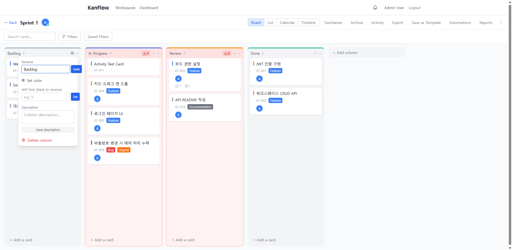

**컬럼 이름 변경**

1. 단계 1: 컬럼 헤더의 설정 아이콘을 클릭합니다.
2. 단계 2: **Rename** 필드에 새 이름을 입력합니다.
3. 단계 3: **Save** 버튼을 클릭합니다.

**컬럼 색상 설정**

1. 단계 1: 설정 메뉴에서 **Set color** 항목을 클릭합니다.
2. 단계 2: 원하는 색상을 선택합니다. 선택한 색상이 컬럼 상단 테두리에 적용됩니다.

**WIP 제한 설정**

1. 단계 1: 설정 메뉴의 **WIP limit** 필드에 최대 카드 수를 숫자로 입력합니다.
2. 단계 2: **Set** 버튼을 클릭하여 적용합니다.
3. 단계 3: 제한을 해제하려면 필드를 비운 후 **Set** 버튼을 클릭합니다.

> **WIP 초과 표시**: WIP 제한을 초과한 컬럼은 컬럼 상단에 빨간 테두리 바가 표시되며 헤더에 경고 아이콘과 카드 수가 나타납니다.

**컬럼 설명 추가**

1. 단계 1: 설정 메뉴의 **Description** 필드에 설명 텍스트를 입력합니다.
2. 단계 2: **Save description** 버튼을 클릭합니다.

**컬럼 접기 / 펼치기**

1. 단계 1: 컬럼 헤더 오른쪽의 `-` (접기) 아이콘을 클릭하면 컬럼이 좁게 접힙니다.
2. 단계 2: 접힌 컬럼의 아이콘을 다시 클릭하면 펼쳐집니다.

**새 컬럼 추가**

1. 단계 1: 보드 맨 오른쪽의 **+ Add column** 버튼을 클릭합니다.
2. 단계 2: 컬럼 이름을 입력합니다.
3. 단계 3: **Enter** 키 또는 저장 버튼을 누릅니다.

**컬럼 삭제**

1. 단계 1: 컬럼 헤더의 `x` 아이콘을 클릭하거나, 설정 메뉴에서 **Delete column** (빨간 텍스트)을 클릭합니다.
2. 단계 2: 삭제 확인 팝업에서 확인을 클릭합니다.

> **팁:** 컬럼을 삭제하면 해당 컬럼 안의 카드들도 함께 삭제됩니다. 카드를 보존하려면 먼저 다른 컬럼으로 이동시키세요.

---

## 4. 카드 상세

### 4.1 카드 상세 패널 열기

카드에 대한 모든 세부 정보를 확인하고 편집할 수 있는 우측 슬라이드 패널입니다.

1. 단계 1: 보드에서 카드 제목을 클릭합니다.
2. 단계 2: 카드 상세 패널이 화면 우측에서 슬라이드되어 열립니다.
3. 단계 3: 모달을 닫으려면 우측 상단의 `×` 버튼 또는 `Esc` 키를 누릅니다.

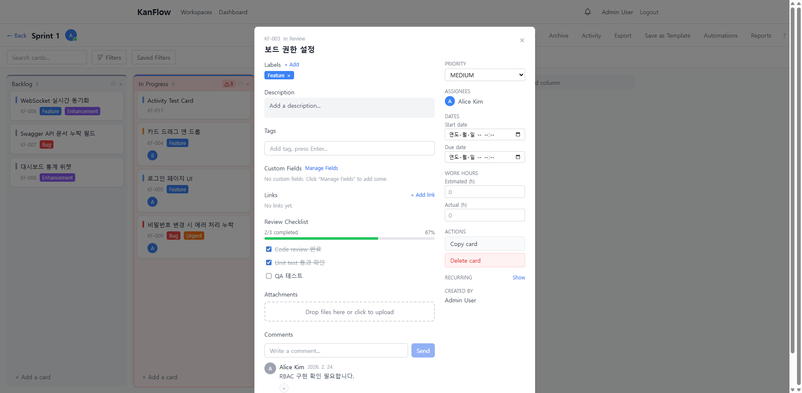

**패널 상단 정보**

- 카드 번호 및 현재 컬럼 위치 (예: `KF-003 In Review`)
- 카드 제목 (클릭하여 인라인 편집 가능)

**패널 상단 탭** (설명 / 댓글 / 체크리스트): Labels, Description, Tags, Custom Fields, Links, Checklist, Attachments, Comments

**패널 속성 영역** (우선순위, 담당자, 마감일): Priority, Assignees, Dates (Start/Due), Work Hours, Actions, Recurring, Created By

---

### 4.2 라벨 관리

라벨을 사용하면 카드를 색상과 텍스트로 분류할 수 있습니다.

**라벨 추가**

1. 단계 1: 카드 상세 모달에서 **Labels** 옆의 **+ Add** 버튼을 클릭합니다.
2. 단계 2: 라벨 선택 드롭다운에서 원하는 라벨을 클릭합니다.
3. 단계 3: 선택한 라벨이 즉시 카드에 적용됩니다.

**라벨 제거**

1. 단계 1: 적용된 라벨 배지 옆의 `×` 아이콘을 클릭합니다.
2. 단계 2: 라벨이 카드에서 제거됩니다.

> **팁:** 카드에는 여러 개의 라벨을 동시에 적용할 수 있습니다. 예를 들어 `Feature`와 `Urgent` 라벨을 함께 사용하여 우선도 높은 기능 요청을 표시할 수 있습니다.

---

### 4.3 설명 작성

카드의 상세 내용을 마크다운으로 작성합니다.

1. 단계 1: 카드 상세 모달에서 **Description** 섹션의 **Add a description...** 영역을 클릭합니다.
2. 단계 2: 텍스트 에디터가 활성화됩니다. 마크다운 문법으로 내용을 입력합니다.
3. 단계 3: 편집 완료 후 저장 버튼을 클릭하거나 에디터 외부를 클릭하면 저장됩니다.

**마크다운 지원 문법 예시**

| 문법 | 결과 |
|------|------|
| `# 제목` | 큰 제목 |
| `**굵게**` | **굵은 텍스트** |
| `- 항목` | 글머리 기호 목록 |
| `` `코드` `` | 인라인 코드 |
| `> 인용` | 인용문 |

---

### 4.4 체크리스트

작업 완료 항목을 체크리스트로 추적합니다. 체크리스트 진행률은 바 형태로 시각적으로 표시됩니다.

**체크리스트 항목 완료 처리**

1. 단계 1: 카드 상세 모달의 체크리스트 섹션에서 완료된 항목의 체크박스를 클릭합니다.
2. 단계 2: 항목이 취소선으로 표시되며 완료 상태로 변경됩니다.
3. 단계 3: 헤더에 `2/3 completed (67%)` 형태로 진행률이 업데이트됩니다.

**새 항목 추가 / 항목 편집**

1. 단계 1: 체크리스트 하단의 항목 추가 버튼을 클릭합니다.
2. 단계 2: 항목 텍스트를 입력하고 **Enter** 키를 누릅니다.

> **팁:** 체크리스트 진행률은 보드 카드에서도 요약 형태로 확인할 수 있어 전체 현황을 빠르게 파악할 수 있습니다.

---

### 4.5 댓글

카드에 댓글을 달아 팀원과 소통합니다.

**댓글 작성**

1. 단계 1: 카드 상세 모달 하단의 **Comments** 섹션으로 스크롤합니다.
2. 단계 2: **Write a comment...** 입력창에 내용을 입력합니다.
3. 단계 3: **Send** 버튼을 클릭하여 댓글을 등록합니다.

작성된 댓글에는 작성자 이름과 작성 시간이 함께 표시됩니다.

> **팁:** 댓글에도 마크다운 문법을 사용할 수 있어 코드 스니펫이나 강조 텍스트를 포함한 서식 있는 댓글을 작성할 수 있습니다.

---

### 4.6 첨부파일

카드에 파일을 업로드하여 관련 자료를 한 곳에 모아둘 수 있습니다.

**파일 첨부**

1. 단계 1: 카드 상세 모달의 **Attachments** 섹션에서 **Drop files here or click to upload** 영역을 클릭합니다.
2. 단계 2: 파일 선택 대화상자에서 업로드할 파일을 선택합니다. 또는 파일을 해당 영역으로 드래그 앤 드롭합니다.
3. 단계 3: 업로드가 완료되면 첨부파일 목록에 표시됩니다.

> **팁:** 이미지 파일의 경우 미리보기가 지원됩니다. 첨부파일은 MinIO 스토리지에 안전하게 저장됩니다.

---

### 4.7 우선순위 / 담당자 / 날짜

카드 상세 모달 우측 영역에서 주요 속성을 설정합니다.

**우선순위 설정**

1. 단계 1: 모달 우측의 **PRIORITY** 드롭다운을 클릭합니다.
2. 단계 2: 우선순위를 선택합니다.

| 우선순위 | 색상 | 의미 |
|----------|------|------|
| CRITICAL | 빨간색 | 즉시 처리 필요 |
| HIGH | 주황색 | 높은 우선순위 |
| MEDIUM | 파란색 | 일반 우선순위 |
| LOW | 회색 | 낮은 우선순위 |

**담당자 지정**

1. 단계 1: 모달 우측의 **ASSIGNEES** 섹션을 클릭합니다.
2. 단계 2: 드롭다운에서 담당자를 선택합니다. 여러 명 선택 가능합니다.
3. 단계 3: 선택한 담당자의 아바타가 표시됩니다.

**날짜 설정**

1. 단계 1: 모달 우측의 **DATES** 섹션에서 **Start date** 필드를 클릭합니다.
2. 단계 2: 날짜 선택기에서 시작일을 선택합니다.
3. 단계 3: **Due date** 필드를 클릭하여 마감일을 설정합니다.

> **팁:** 마감일이 설정된 카드는 캘린더 뷰와 타임라인 뷰에서 시각적으로 확인할 수 있습니다. 마감일이 임박하면 보드 카드에 날짜 배지가 강조 표시됩니다.

---

### 4.8 작업시간

예상 작업시간과 실제 소요시간을 기록합니다.

1. 단계 1: 모달 우측의 **WORK HOURS** 섹션에서 **Estimated (h)** 필드에 예상 시간을 숫자로 입력합니다 (단위: 시간).
2. 단계 2: 작업 완료 후 **Actual (h)** 필드에 실제 소요 시간을 입력합니다.
3. 단계 3: 입력 필드 외부를 클릭하면 자동 저장됩니다.

> **팁:** 작업시간 데이터는 리포트 페이지의 팀 워크로드 분석에 활용됩니다.

---

### 4.9 태그

자유 형식의 태그로 카드를 추가 분류합니다.

1. 단계 1: 카드 상세 모달의 **Tags** 섹션을 찾습니다.
2. 단계 2: **Add tag, press Enter...** 입력창에 태그 텍스트를 입력합니다.
3. 단계 3: **Enter** 키를 누르면 태그가 추가됩니다.
4. 단계 4: 태그를 제거하려면 태그 배지 옆의 `×` 아이콘을 클릭합니다.

> **팁:** 태그는 라벨과 달리 미리 정의된 목록 없이 자유롭게 생성됩니다. `#sprint-2`, `#backend`, `#urgent` 등 팀 내 약속된 태그 체계를 만들어 활용하면 편리합니다.

---

### 4.10 카드 링크

연관된 다른 카드를 링크로 연결합니다.

**링크 추가**

1. 단계 1: 카드 상세 모달의 **Links** 섹션에서 **+ Add link** 버튼을 클릭합니다.
2. 단계 2: 연결할 카드를 검색하거나 URL을 입력합니다.
3. 단계 3: 링크 유형(관련 / 차단 / 차단됨)을 선택합니다.
4. 단계 4: 확인 버튼을 클릭하여 링크를 추가합니다.

---

### 4.11 커스텀 필드

프로젝트 특성에 맞는 추가 필드를 카드에 연결합니다.

**커스텀 필드 관리**

1. 단계 1: 카드 상세 모달의 **Custom Fields** 섹션에서 **Manage Fields** 링크를 클릭합니다.
2. 단계 2: 보드의 커스텀 필드 관리 화면으로 이동합니다.
3. 단계 3: **+ Add field** 버튼을 클릭하여 새 필드를 추가합니다.
4. 단계 4: 필드 유형을 선택합니다. (텍스트, 숫자, 드롭다운, 날짜)
5. 단계 5: 필드 이름을 입력하고 저장합니다.

**커스텀 필드 값 입력**

1. 단계 1: 카드 상세 모달로 돌아와 **Custom Fields** 섹션에서 해당 필드를 찾습니다.
2. 단계 2: 필드 값을 입력하거나 선택합니다.
3. 단계 3: 자동으로 저장됩니다.

---

### 4.12 카드 복사 / 삭제

**카드 복사**

1. 단계 1: 카드 상세 모달 우측의 **ACTIONS** 섹션에서 **Copy card** 버튼을 클릭합니다.
2. 단계 2: 복사할 대상 컬럼을 선택합니다.
3. 단계 3: 복사된 카드가 해당 컬럼에 생성됩니다.

**카드 삭제**

1. 단계 1: 카드 상세 모달 우측의 **ACTIONS** 섹션에서 **Delete card** 버튼(빨간색)을 클릭합니다.
2. 단계 2: 삭제 확인 대화상자에서 **Delete**를 클릭합니다.

> **팁:** 카드를 완전히 삭제하는 대신 아카이브하면 나중에 복원할 수 있습니다. 삭제는 복구가 불가능하니 신중히 사용하세요.

---

## 5. 다양한 뷰

KanFlow는 칸반 보드 외에도 다양한 뷰를 제공합니다. 보드 상단 탭에서 원하는 뷰로 즉시 전환할 수 있습니다.

### 5.1 리스트 뷰

카드를 테이블 형식으로 표시합니다. 여러 카드의 속성을 한 번에 비교하거나, 정렬 및 필터 기능과 함께 활용하면 효율적입니다.

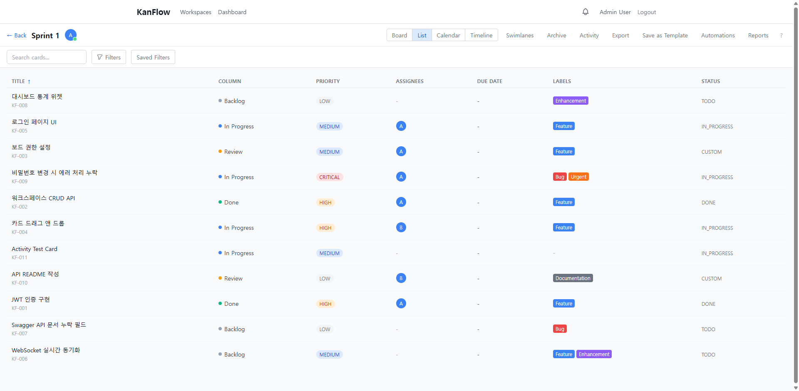

1. 단계 1: 보드 상단 탭에서 **List** 를 클릭합니다.
2. 단계 2: 카드 목록이 테이블 형식으로 표시됩니다.
3. 단계 3: 컬럼 헤더(TITLE, COLUMN, PRIORITY, ASSIGNEES, DUE DATE, LABELS, STATUS)를 클릭하면 해당 기준으로 정렬됩니다.
4. 단계 4: 카드 제목을 클릭하면 카드 상세 모달이 열립니다.

**표시 항목**

| 컬럼 | 설명 |
|------|------|
| TITLE | 카드 제목 및 카드 번호 |
| COLUMN | 현재 속한 컬럼 (상태 표시 점 포함) |
| PRIORITY | 우선순위 배지 (색상으로 구분) |
| ASSIGNEES | 담당자 아바타 |
| DUE DATE | 마감일 |
| LABELS | 적용된 라벨 배지 |
| STATUS | 카드 상태 |

> **팁:** 리스트 뷰는 마감일, 우선순위, 담당자 기준으로 정렬하여 스프린트 계획이나 진행 상황 점검 시 특히 유용합니다.

---

### 5.2 캘린더 뷰

마감일이 설정된 카드를 월간 달력 형식으로 표시합니다.

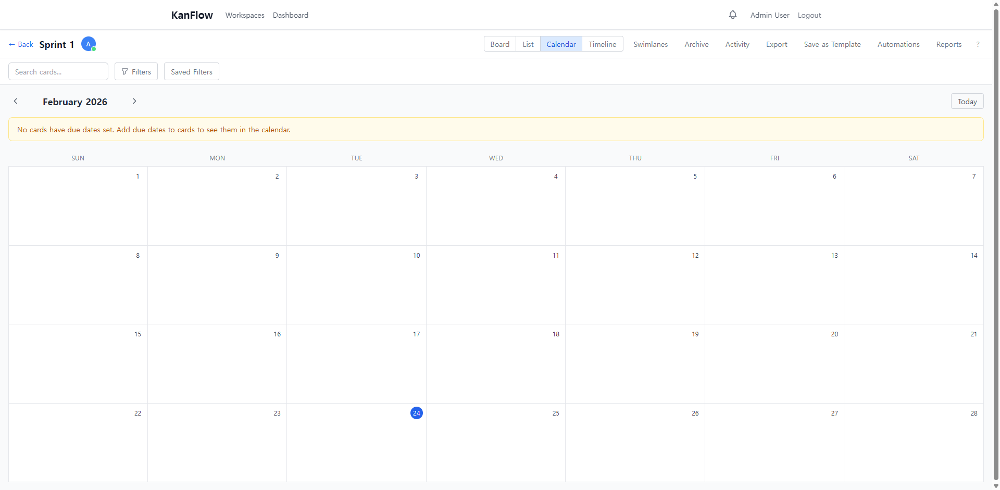

1. 단계 1: 보드 상단 탭에서 **Calendar** 를 클릭합니다.
2. 단계 2: 현재 월의 달력이 표시됩니다. 마감일이 설정된 카드가 해당 날짜에 나타납니다.
3. 단계 3: 좌우 화살표(`<` `>`)를 클릭하여 이전/다음 월로 이동합니다.
4. 단계 4: **Today** 버튼을 클릭하면 오늘 날짜로 즉시 이동합니다.
5. 단계 5: 달력에 표시된 카드를 클릭하면 카드 상세 모달이 열립니다.

> **팁:** 카드에 마감일을 설정해야 캘린더에 표시됩니다. 마감일이 없는 카드는 캘린더에 나타나지 않습니다. 노란색 안내 배너가 표시될 경우 카드에 마감일을 추가해 주세요.

---

### 5.3 타임라인 뷰

카드의 시작일~마감일을 간트 차트 스타일로 시각화합니다. 프로젝트 일정 관리에 유용합니다.

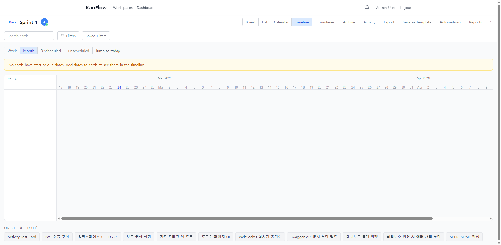

1. 단계 1: 보드 상단 탭에서 **Timeline** 을 클릭합니다.
2. 단계 2: **Week** / **Month** 버튼으로 시간 단위를 전환합니다.
3. 단계 3: **Jump to today** 버튼을 클릭하면 오늘 날짜 위치로 이동합니다.
4. 단계 4: 시작일과 마감일이 설정된 카드는 타임라인 바로 표시됩니다.
5. 단계 5: 하단의 **UNSCHEDULED** 섹션에는 날짜가 미설정된 카드 목록이 표시됩니다. 해당 카드를 타임라인 영역으로 드래그하여 날짜를 설정할 수 있습니다.

> **팁:** 타임라인 바를 좌우로 드래그하여 날짜를 조정할 수 있습니다. 또한 바의 끝 부분을 드래그하면 기간을 늘리거나 줄일 수 있습니다.

---

### 5.4 스윔레인 뷰

카드를 수평 행(스윔레인)으로 그룹화하여 표시합니다. 팀, 우선순위, 카테고리 등으로 작업을 구분할 때 활용합니다.

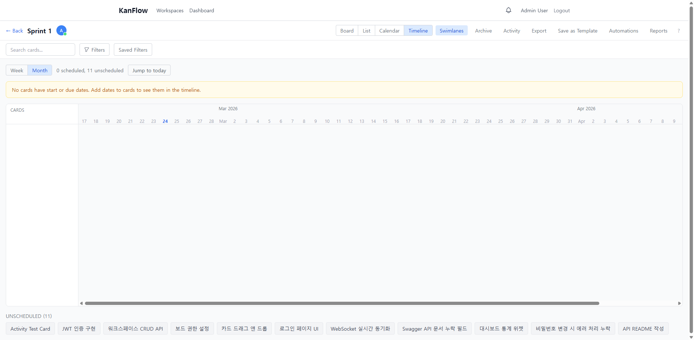

1. 단계 1: 보드 상단 탭에서 **Swimlanes** 를 클릭합니다.
2. 단계 2: 스윔레인 행과 컬럼이 격자 형태로 표시됩니다.
3. 단계 3: 각 스윔레인의 왼쪽 이름 옆 삼각형(`▼`)을 클릭하면 해당 스윔레인을 접거나 펼칠 수 있습니다.
4. 단계 4: 하단의 **+ Add swimlane** 버튼을 클릭하여 새 스윔레인을 추가합니다.

> **팁:** 스윔레인 뷰에서도 카드 드래그 앤 드롭이 가능합니다. 카드를 다른 스윔레인의 컬럼으로 이동하면 컬럼(상태)과 스윔레인 분류가 동시에 변경됩니다.

---

## 6. 검색 및 필터

### 6.1 카드 검색

보드 내 카드를 제목으로 즉시 검색합니다.

1. 단계 1: 보드 화면 좌측 상단의 **Search cards...** 입력창을 클릭합니다. 또는 키보드 단축키 `f` 를 누릅니다.
2. 단계 2: 검색할 키워드를 입력합니다. 입력과 동시에 결과가 필터링됩니다.
3. 단계 3: 검색어와 일치하는 카드만 보드에 표시되고, 일치하지 않는 카드는 흐리게 처리됩니다.

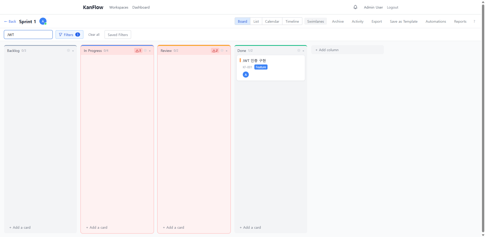

4. 단계 4: 검색을 초기화하려면 입력창의 내용을 지우거나 **Clear all** 버튼을 클릭합니다.

> **팁:** 컬럼 헤더에 표시되는 숫자(예: `Done 1/2`)는 전체 카드 수 중 현재 필터에 매칭된 카드 수를 나타냅니다.

---

### 6.2 고급 필터

우선순위, 담당자, 라벨, 마감일 등 다양한 조건으로 카드를 필터링합니다.

1. 단계 1: 보드 상단의 **Filters** 버튼을 클릭합니다.
2. 단계 2: 필터 패널이 검색창 아래에 펼쳐집니다.

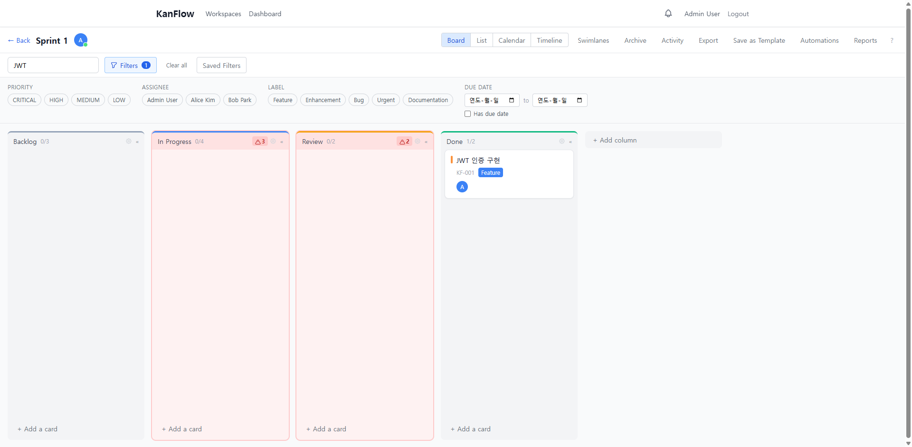

3. 단계 3: 원하는 필터 조건을 선택합니다.

| 필터 항목 | 선택 가능 값 |
|-----------|-------------|
| PRIORITY | CRITICAL / HIGH / MEDIUM / LOW |
| ASSIGNEE | 보드 멤버 이름 |
| LABEL | 보드에 등록된 라벨 |
| DUE DATE | 날짜 범위 입력 또는 **Has due date** 체크박스 |

4. 단계 4: 여러 조건을 동시에 선택하면 AND 조건으로 필터링됩니다.
5. 단계 5: 필터를 해제하려면 각 조건을 다시 클릭하거나 **Clear all** 버튼을 클릭합니다.

> **팁:** 검색어와 고급 필터를 동시에 사용할 수 있습니다. 예를 들어 검색창에 "API"를 입력하고 PRIORITY에서 "HIGH"를 선택하면 제목에 "API"가 포함된 HIGH 우선순위 카드만 표시됩니다.

---

### 6.3 저장된 필터

자주 사용하는 필터 조건을 저장해두고 나중에 빠르게 불러올 수 있습니다.

**필터 저장**

1. 단계 1: 원하는 필터 조건을 설정합니다.
2. 단계 2: 상단의 **Saved Filters** 버튼 옆 저장 아이콘을 클릭합니다.
3. 단계 3: 필터 이름을 입력하고 저장합니다.

**저장된 필터 불러오기**

1. 단계 1: **Saved Filters** 버튼을 클릭합니다.
2. 단계 2: 저장된 필터 목록에서 원하는 항목을 클릭합니다.
3. 단계 3: 해당 필터 조건이 즉시 적용됩니다.

> **팁:** "내 담당 카드 + 미완료" 같은 자주 사용하는 필터 조합을 저장해두면 매번 조건을 설정하는 번거로움을 줄일 수 있습니다.

---

## 7. 알림

### 7.1 알림 확인

KanFlow는 담당자 지정, 댓글 작성 등 관련 이벤트 발생 시 실시간으로 알림을 제공합니다.

1. 단계 1: NavBar 상단의 종 아이콘(알림 벨)을 클릭합니다.
2. 단계 2: 활동/알림 패널이 화면 우측에서 슬라이드되어 열립니다.

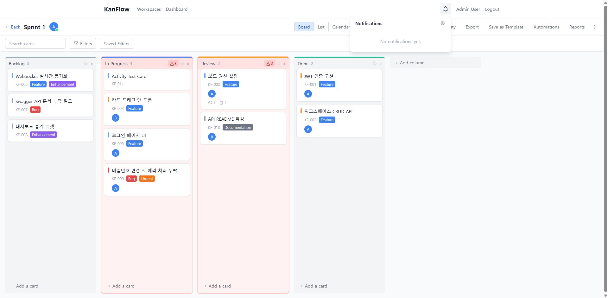

3. 단계 3: 알림 항목을 클릭하면 해당 카드 또는 보드로 이동합니다.

**알림 패널 탭**

| 탭 | 내용 |
|----|------|
| 전체 | 모든 활동 및 알림 |
| 멘션 | 댓글에서 나를 멘션한 알림 |
| 마감일 | 마감 임박 및 마감 초과 카드 알림 |
| 배정됨 | 내가 담당자로 지정된 카드 알림 |

패널 상단의 **모두 읽음** 버튼으로 모든 알림을 한 번에 읽음 처리할 수 있습니다.

**알림이 발생하는 이벤트**

- 내가 담당자로 지정된 카드
- 내가 멘션된 댓글
- 담당 카드의 마감일 임박
- 담당 카드의 상태 변경

> **팁:** 알림 벨 아이콘에 숫자 배지가 표시되면 확인하지 않은 새 알림이 있다는 의미입니다.

---

### 7.2 알림 관리

알림 패널 우측 상단의 설정 아이콘을 클릭하면 알림 설정 화면으로 이동합니다.

1. 단계 1: 알림 패널 상단의 설정(톱니바퀴) 아이콘을 클릭합니다.
2. 단계 2: 알림을 받을 이벤트 유형을 활성화/비활성화합니다.
3. 단계 3: **모두 읽음 표시** 버튼으로 모든 알림을 한 번에 읽음 처리할 수 있습니다.

---

## 8. 대시보드

대시보드는 내가 속한 모든 워크스페이스와 보드에 걸쳐 중요한 정보를 한 곳에서 확인할 수 있는 개인 홈 화면입니다.

상단 내비게이션 바의 **Dashboard** 링크를 클릭하면 이동합니다.

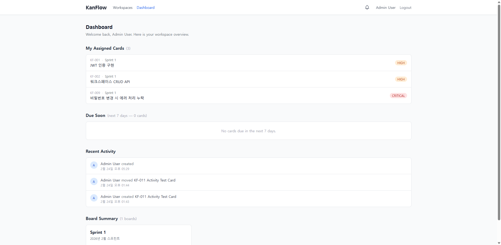

---

### 8.1 나의 할당 카드

**My Assigned Cards** 섹션에는 내가 담당자로 지정된 모든 카드가 표시됩니다.

- 카드 번호, 보드 이름, 카드 제목, 우선순위 배지가 표시됩니다.
- 카드를 클릭하면 해당 보드로 이동하고 카드 상세 모달이 열립니다.

---

### 8.2 마감 임박 카드

**Due Soon** 섹션에는 앞으로 7일 이내에 마감일이 도래하는 카드가 표시됩니다.

- 마감일이 가까운 카드를 미리 파악하여 우선 처리할 수 있습니다.
- 카드 수가 괄호 안에 표시됩니다 (예: `Due Soon (next 7 days — 3 cards)`).

---

### 8.3 최근 활동

**Recent Activity** 섹션에는 내가 속한 보드들에서 발생한 최근 활동 이력이 시간순으로 표시됩니다.

- 누가 어떤 카드를 생성/이동/수정했는지 확인할 수 있습니다.
- 예: `Admin User moved KF-011 Activity Test Card`, `Admin User created`

---

### 8.4 보드 요약

**Board Summary** 섹션에는 접근 가능한 보드들의 요약 정보가 카드 형식으로 표시됩니다.

- 보드 이름, 설명, 카드 수, 멤버 수가 표시됩니다.
- 보드 카드를 클릭하면 해당 보드로 바로 이동합니다.

> **팁:** 대시보드는 매일 업무 시작 시 "오늘 내가 해야 할 일"을 파악하는 데 활용하면 좋습니다. 나의 할당 카드와 마감 임박 카드를 확인하고 우선순위를 정하세요.

---

## 9. 활동 로그

활동 로그는 보드에서 발생한 모든 변경 이력을 시간순으로 기록합니다. 누가 무엇을 변경했는지 추적할 수 있습니다.

1. 단계 1: NavBar의 종(벨) 아이콘을 클릭하거나, 보드 상단 탭에서 **Activity** 를 클릭합니다.
2. 단계 2: 화면 우측 DetailPanel에 활동 로그가 표시됩니다.

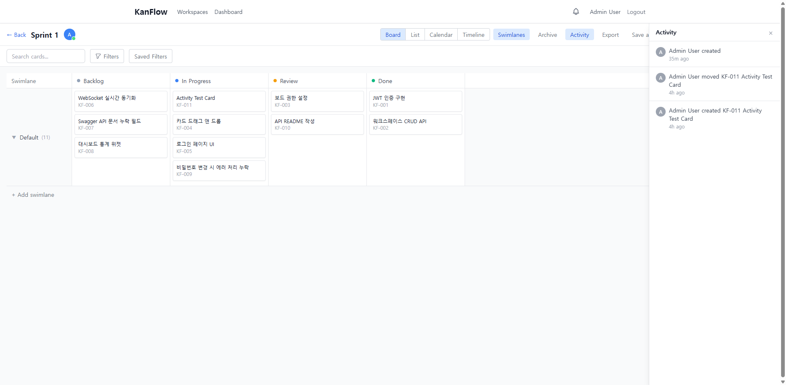

**기록되는 활동 유형**

- 카드 생성 (예: `Admin User created KF-011 Activity Test Card`)
- 카드 이동 (예: `Admin User moved KF-011 Activity Test Card`)
- 카드 수정 (제목, 담당자, 우선순위, 날짜 변경 등)
- 댓글 작성
- 컬럼 생성/삭제/이름 변경

각 항목에는 활동 내용, 작성자, 경과 시간(예: `35m ago`, `4h ago`)이 표시됩니다.

3. 단계 3: 패널을 닫으려면 우측 상단의 `×` 버튼을 클릭하거나 `Esc` 키를 누릅니다.

> **팁:** 활동 로그는 팀 협업 시 "최근에 무엇이 바뀌었는가"를 파악하거나, 예기치 않은 변경 사항을 추적하는 데 유용합니다.

---

## 10. 아카이브

완료되었거나 더 이상 활성화할 필요 없는 카드를 아카이브합니다. 삭제와 달리 아카이브된 항목은 언제든지 복원할 수 있습니다.

1. 단계 1: 보드 상단 탭에서 **Archive** 를 클릭합니다.
2. 단계 2: 보드 우측에 **Archived Cards** 패널이 열립니다.

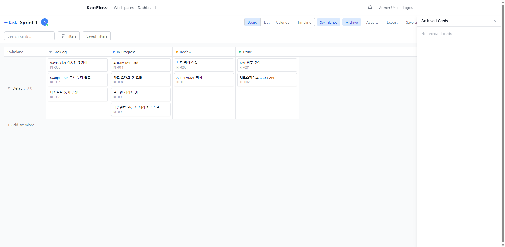

**카드 아카이브하기**

1. 단계 1: 아카이브할 카드의 상세 모달을 엽니다.
2. 단계 2: 카드 상세 모달 상단 또는 액션 메뉴에서 **Archive** 버튼을 클릭합니다.
3. 단계 3: 카드가 보드에서 사라지고 아카이브 패널에 추가됩니다.

**아카이브된 카드 복원하기**

1. 단계 1: **Archive** 탭을 클릭하여 아카이브 패널을 엽니다.
2. 단계 2: 복원할 카드 항목 옆의 **Restore** 버튼을 클릭합니다.
3. 단계 3: 카드가 원래 컬럼으로 복원됩니다.

**아카이브된 카드 완전 삭제**

1. 단계 1: 아카이브 패널에서 삭제할 카드 항목 옆의 **Delete** 버튼을 클릭합니다.
2. 단계 2: 삭제 확인 대화상자에서 **Delete**를 클릭합니다. 이 작업은 취소할 수 없습니다.

> **팁:** 정기적으로 완료된 스프린트 카드를 아카이브하면 보드를 깔끔하게 유지할 수 있습니다. 아카이브된 카드들은 리포트 분석에 여전히 반영됩니다.

---

## 11. 키보드 단축키

자주 사용하는 작업을 키보드로 빠르게 실행할 수 있습니다. 보드 화면에서 `?` 키를 누르면 단축키 도움말이 표시됩니다.

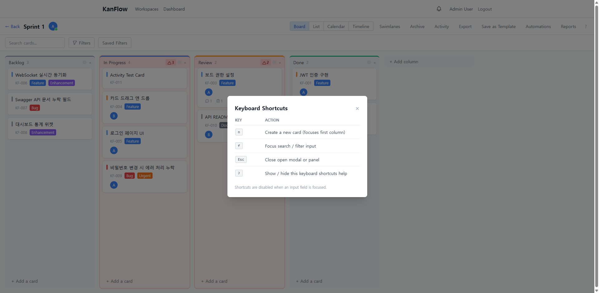

**기본 단축키 목록**

| 단축키 | 동작 |
|--------|------|
| `n` | 새 카드 생성 (첫 번째 컬럼에 입력창 포커스) |
| `f` | 검색 / 필터 입력창으로 포커스 이동 |
| `Esc` | 열려 있는 모달 또는 패널 닫기 |
| `?` | 키보드 단축키 도움말 표시 / 숨기기 |

> **팁:** 단축키는 입력 필드(텍스트 입력창, 댓글창 등)에 포커스가 있을 때는 비활성화됩니다. 입력창 외부를 클릭하여 포커스를 해제한 후 단축키를 사용하세요.

---

## 12. 자동화 규칙

자동화 규칙을 설정하면 반복적인 작업을 자동으로 처리할 수 있습니다. "트리거 → 조건 → 액션" 구조로 규칙을 구성합니다.

### 12.1 자동화 규칙 목록

1. 단계 1: 보드 상단 탭에서 **Automations** 를 클릭합니다.
2. 단계 2: 자동화 규칙 관리 페이지로 이동합니다.

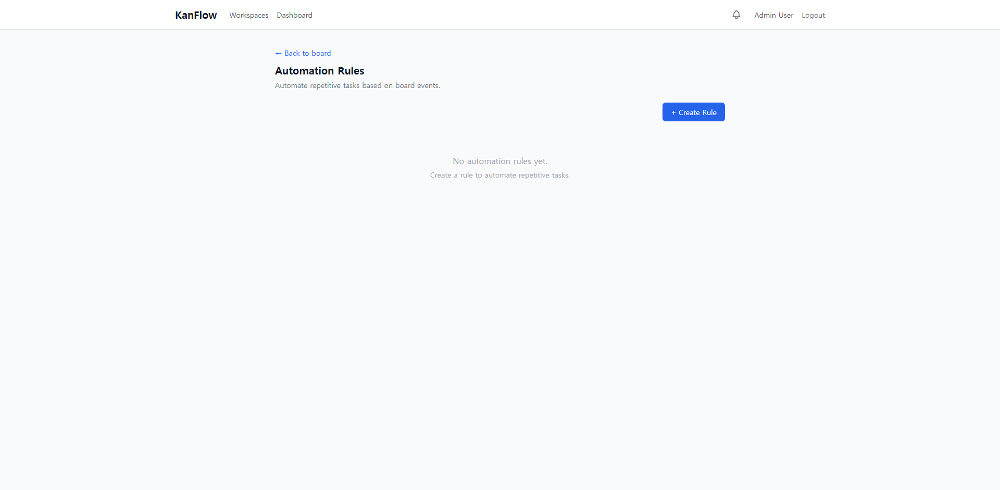

페이지에는 현재 보드에 설정된 자동화 규칙 목록이 표시됩니다. 규칙이 없는 경우 `No automation rules yet.` 메시지가 나타납니다.

---

### 12.2 자동화 규칙 생성

1. 단계 1: 자동화 규칙 페이지에서 **+ Create Rule** 버튼을 클릭합니다.
2. 단계 2: 규칙 생성 폼이 나타납니다.

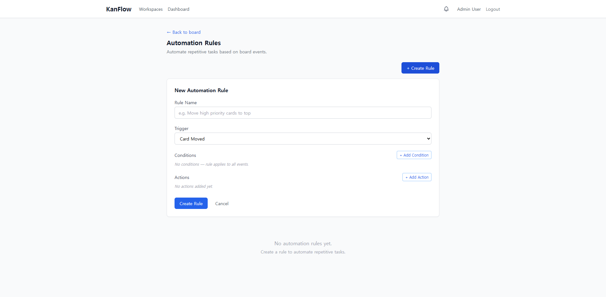

3. 단계 3: **Rule Name** 필드에 규칙 이름을 입력합니다 (예: `Move high priority cards to top`).
4. 단계 4: **Trigger** 드롭다운에서 트리거 이벤트를 선택합니다.

**트리거 유형 예시**

| 트리거 | 설명 |
|--------|------|
| Card Moved | 카드가 다른 컬럼으로 이동될 때 |
| Card Created | 새 카드가 생성될 때 |
| Due Date Approaching | 마감일이 X일 이내로 임박했을 때 |
| Priority Changed | 우선순위가 변경될 때 |

5. 단계 5: **+ Add Condition** 버튼을 클릭하여 조건을 추가합니다. 조건이 없으면 모든 이벤트에 규칙이 적용됩니다.
6. 단계 6: **+ Add Action** 버튼을 클릭하여 실행할 액션을 추가합니다.

**액션 유형 예시**

| 액션 | 설명 |
|------|------|
| Move Card | 카드를 지정된 컬럼으로 이동 |
| Assign Member | 담당자 자동 할당 |
| Set Priority | 우선순위 자동 변경 |
| Add Label | 라벨 자동 추가 |

7. 단계 7: **Create Rule** 버튼을 클릭하여 규칙을 저장합니다.
8. 단계 8: 규칙을 취소하려면 **Cancel** 버튼을 클릭합니다.

> **팁:** 자동화 규칙 예시: "카드가 `Done` 컬럼으로 이동되면 자동으로 `Completed` 라벨을 추가"와 같이 반복 작업을 줄이는 규칙을 만들어보세요.

---

## 13. 리포트

보드의 카드 분포, 우선순위, 팀 워크로드 등을 시각적으로 분석합니다.

### 13.1 보드 통계 요약

1. 단계 1: 보드 상단 탭에서 **Reports** 를 클릭합니다.
2. 단계 2: 리포트 페이지로 이동합니다.

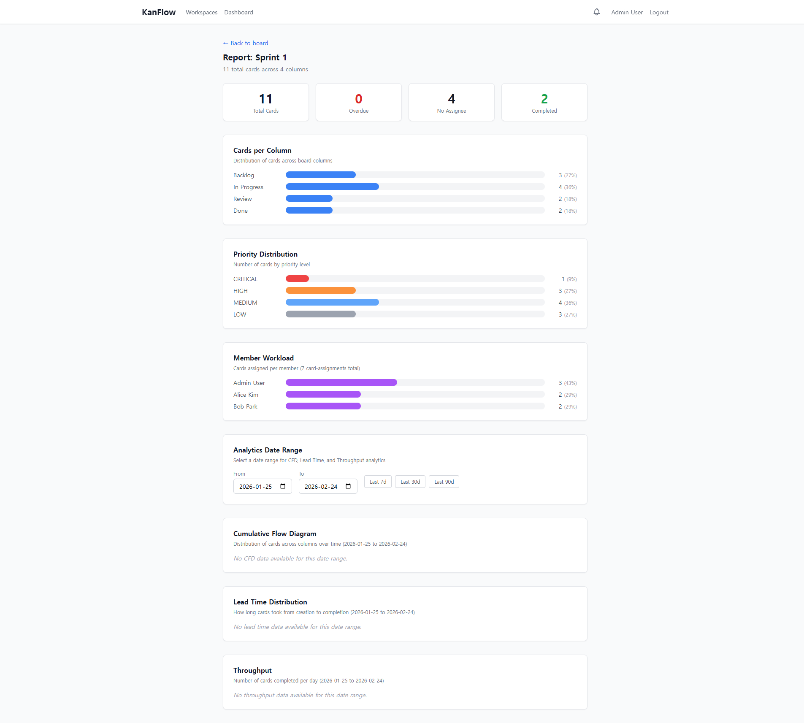

페이지 상단에는 4개의 핵심 지표가 카드 형태로 표시됩니다.

| 지표 | 설명 |
|------|------|
| Total Cards | 보드 전체 카드 수 |
| Overdue | 마감일이 지난 카드 수 (빨간색) |
| No Assignee | 담당자가 없는 카드 수 |
| Completed | 완료 상태 카드 수 (초록색) |

---

### 13.2 분석 차트

**Cards per Column (컬럼별 카드 분포)**

- 각 컬럼에 속한 카드 수와 전체 대비 비율을 막대 그래프로 표시합니다.
- 특정 컬럼에 카드가 몰려있는 병목 현상을 파악하는 데 활용합니다.

**Priority Distribution (우선순위 분포)**

- CRITICAL / HIGH / MEDIUM / LOW 별 카드 수를 색상 막대 그래프로 표시합니다.
- 팀의 전반적인 작업 긴급도를 파악합니다.

**Member Workload (멤버 워크로드)**

- 각 팀원에게 할당된 카드 수와 비율을 표시합니다.
- 특정 팀원에게 작업이 과도하게 집중되어 있는지 확인합니다.

**Analytics Date Range (날짜 범위 분석)**

1. 단계 1: **From** 과 **To** 날짜 필드에 분석 기간을 입력합니다.
2. 단계 2: 빠른 선택 버튼 **Last 7d** / **Last 30d** / **Last 90d** 를 클릭하여 기간을 설정합니다.
3. 단계 3: 설정한 기간에 해당하는 CFD, 리드 타임, 처리량 데이터가 업데이트됩니다.

**분석 차트 종류**

| 차트 | 설명 |
|------|------|
| Cumulative Flow Diagram (CFD) | 기간별 각 컬럼의 카드 수 변화를 누적 면적 차트로 표시 |
| Lead Time Distribution | 카드 생성부터 완료까지 걸린 시간 분포 |
| Throughput | 일별 완료된 카드 수 추이 |

> **팁:** CFD(누적 흐름 다이어그램)는 특정 컬럼에서 카드가 정체되고 있는지 파악하는 데 효과적입니다. 특정 컬럼의 면적이 지속적으로 증가한다면 해당 단계에서 병목이 발생하고 있는 신호입니다.

---

*이 문서는 KanFlow v2.0 기준으로 작성되었습니다. 기능 업데이트에 따라 일부 내용이 변경될 수 있습니다.*
